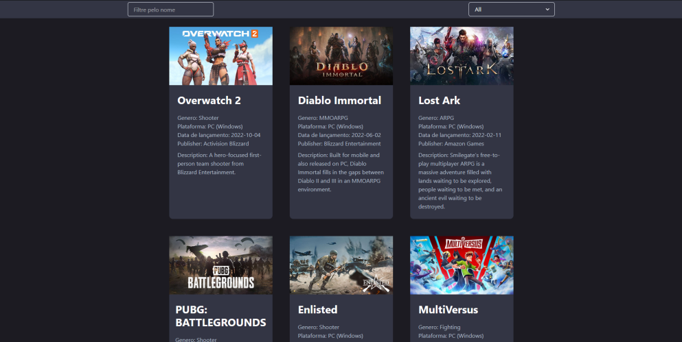

<div align="center" id="top"> 
  

&#xa0;

<a href="https://games-frontend-ekn7ied52-zerobulletiss.vercel.app/">Demo</a>

</div>

<h1 align="center">games-frontend</h1>

<p align="center">
  

  

  

</p>

<p align="center">
  <a href="#dart-about">About</a> &#xa0; | &#xa0; 
  <a href="#sparkles-features">Features</a> &#xa0; | &#xa0;
  <a href="#rocket-technologies">Technologies</a> &#xa0; | &#xa0;
  <a href="#white_check_mark-requirements">Requirements</a> &#xa0; | &#xa0;
  <a href="#checkered_flag-starting">Starting</a> &#xa0; | &#xa0;
  <a href="#memo-license">License</a> &#xa0; | &#xa0;
  <a href="https://github.com/Buletiss" target="_blank">Author</a>
</p>

<br>

## :dart: About

Projeto de Estágio Frontend React para a empresa App Masters
Neste projeto foi necessario consumir uma API de jogos fornecida pela empresa, mostrar em tela, tratar possiveis erros obtidos da API e fazer filtros para a busca de Games

## :sparkles: Features

:heavy_check_mark: Show all games and information
:heavy_check_mark: Search the game by name\
:heavy_check_mark: Select to filter game by genre

## :rocket: Technologies

The following tools were used in this project:

- [Axios](https://axios-http.com)
- [React](https://pt-br.reactjs.org/)
- [Chraka UI](https://chakra-ui.com/)
- [TypeScript](https://www.typescriptlang.org/)

## :white_check_mark: Requirements

Before starting :checkered_flag:, you need to have [Git](https://git-scm.com) and [Node](https://nodejs.org/en/) installed.

## :checkered_flag: Starting

```bash
# Clone this project
$ git clone https://github.com/Buletiss/games-frontend

# Access
$ cd games-frontend

# Install dependencies
$ yarn

# Run the project
$ yarn start

# The server will initialize in the <http://localhost:3000>
```

## :memo: License

This project is under license from MIT. For more details, see the [LICENSE](LICENSE.md) file.

Made with :heart: by <a href="https://github.com/Buletiss" target="_blank">Buletiss</a>

&#xa0;

<a href="#top">Back to top</a>
